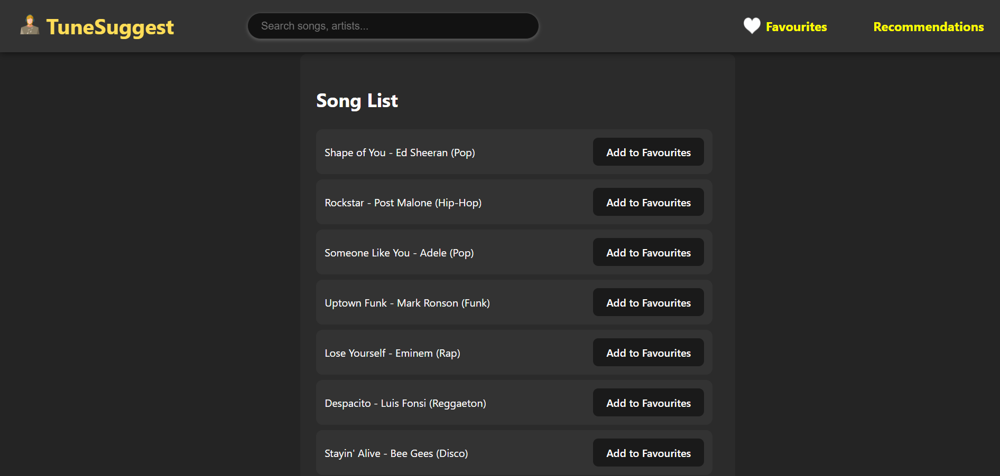

# TuneSuggest


## <a name="tech-stack">⚙️ Tech Stack</a>

- React
- JavaScript
- Vite
- Tailwind CSS

## <a name="features">🔋 Features</a>

👉 **Song Recommendations**: Provides personalized song recommendations based on user preferences and listening history.

👉 **Favorites Management**:
  - **Add to Favorites**: Users can mark songs as favorites for easy access.
  - **Remove from Favorites**: Users can easily unmark songs from their favorites list.

👉 **Search Functionality**: Users can search for songs and artists, filtering results dynamically.

👉 **Responsive Design**: The application is fully responsive and optimized for both desktop and mobile devices.

👉 **User-Friendly Interface**: Intuitive navigation and interface for a seamless user experience.

👉 **Dropdown Menus**: Easily access favorites and recommendations with dropdown menus in the navigation bar.

👉 **Real-Time Updates**: Any changes in favorites or recommendations reflect immediately in the UI.

## <a name="quick-start">🤸 Quick Start</a>

Follow these steps to set up the project locally on your machine.

**Prerequisites**

Make sure you have the following installed on your machine:

- [Git](https://git-scm.com/)
- [Node.js](https://nodejs.org/en)
- [npm](https://www.npmjs.com/) (Node Package Manager)

**Cloning the Repository**

```bash
git clone https://github.com/your-username/tunesuggest.git
cd tunesuggest
```

**Installation**

Install the project dependencies using npm:

```bash
npm install
```

**Running the Project**

```bash
npm run dev
```

Open [http://localhost:5173](http://localhost:5173) in your browser to view the project.
